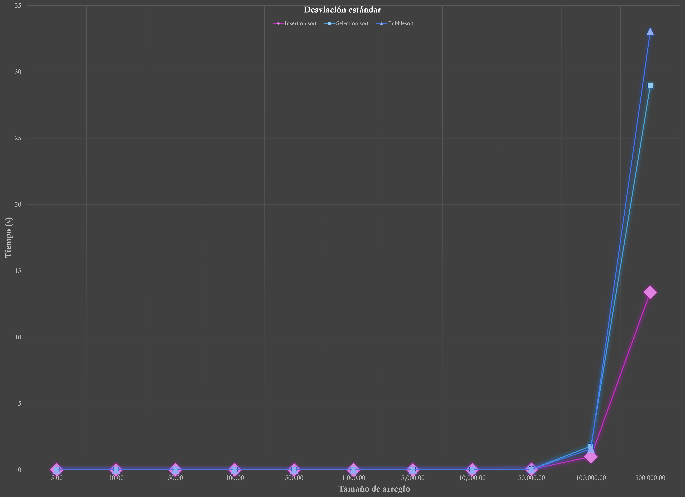

# Práctica 4: Análisis Experimental de Algoritmos de Ordenamiento

## Objetivo

El objetivo de esta práctica es realizar un análisis experimental del tiempo de ejecución de cinco algoritmos de ordenamiento: insertion sort, selection sort, bubblesort, merge sort y quicksort. Se busca comparar el rendimiento de estos algoritmos en función del tamaño del arreglo a ordenar.

## Introducción

Este informe presenta los resultados de un análisis experimental del tiempo de ejecución de cinco algoritmos de ordenamiento: insertion sort, selection sort, bubblesort, merge sort y quicksort. El objetivo es comparar el rendimiento de estos algoritmos en función del tamaño del arreglo a ordenar.

## Procedimiento

Para llevar a cabo el análisis experimental, se implementó un programa de control denominado "ordenamiento.cpp". Este programa recibe por línea de comando el tamaño del arreglo (n) y el número de arreglos a generar y ordenar (m). A continuación, se generan m arreglos aleatorios de tamaño n y se ejecuta cada algoritmo de ordenamiento sobre ellos. Se registran los tiempos de ejecución de cada algoritmo y se calcula el promedio y la desviación estándar del tiempo de ejecución para cada valor de n.

Además, se genera un archivo de salida con los tiempos registrados en una estructura tabular para cada tamaño n. Este archivo servirá para realizar el análisis estadístico y la generación de gráficas.

### Estructura del Código y Funciones Principales

- **Estructura TiemposAlgoritmos:**
  - Almacena los tiempos de ejecución de los algoritmos.

- **Funciones ejecutar_y_medir_tiempo:**
  - Mide el tiempo de ejecución de un algoritmo de ordenamiento en un arreglo.

- **Función generar_arreglo_aleatorio:**
  - Genera arreglos aleatorios de tamaño especificado.

- **Funciones calcular_promedio y calcular_desviacion_estandar:**
  - Calculan el promedio y la desviación estándar de un conjunto de tiempos.

- **Función main:**
  - Lee argumentos de línea de comandos para definir el tamaño del arreglo, el número de repeticiones y los algoritmos a evaluar.
  - Genera arreglos aleatorios y mide los tiempos de ejecución de los algoritmos seleccionados.
  - Escribe los resultados en un archivo "resultados.txt".
  - Calcula y muestra promedios y desviaciones estándar de los tiempos.

## Resultados

Los resultados obtenidos muestran el tiempo promedio y la desviación estándar del tiempo de ejecución para cada algoritmo en función del tamaño del arreglo. Los resultados revelan que el tiempo de ejecución de los algoritmos de ordenamiento exhibe una variación significativa en función del tamaño de los datos a ordenar (n). Quicksort se destacó consistentemente al mostrar un rendimiento superior en comparación con los algoritmos de orden cuadrático (insertion sort, selection sort, bubblesort). Además, se observó que los algoritmos recursivos (merge sort, quicksort) demostraron un mejor rendimiento para valores grandes de n.

A continuación se presentan las tablas con los tiempos de cada algoritmo:

### Promedio

- Iteratividad:
  

- Recursividad:

### Desviación estándar

- Iteratividad:

- Recursividad:

En una representación gráfica:

### Promedio

- Iteratividad:
  

- Recursividad:

### Desviación estándar

- Iteratividad:

- Recursividad:

#### Nota
Los experimentos con valores extremadamente grandes de n, específicamente n=500,000,000 y n=1,000,000,000, no pudieron ser realizados debido a limitaciones en los recursos computacionales. En estos casos, el programa termina el proceso sin regresar ningún valor debido a la alta demanda de recursos computacionales. Asimismo, a partir de n=500,000, no se llevaron a cabo experimentos con los algoritmos insertion sort, selection sort y bubblesort, ya que el tiempo de ejecución para estos valores era considerablemente largo y el proceso finalizaba sin arrojar resultados. Estas limitaciones deben tenerse en cuenta al interpretar los resultados y al considerar la escalabilidad de los algoritmos para conjuntos de datos de gran tamaño.

## Análisis de resultados

A partir de las gráficas y los datos obtenidos, se observa que:

- **Insertion sort:**
  - Este algoritmo es eficiente para conjuntos de datos pequeños o casi ordenados.
  - Tiene una complejidad de tiempo promedio de O(n^2), lo que significa que su rendimiento empeora significativamente para conjuntos de datos grandes.
  - Es estable y funciona bien en conjuntos de datos con pocos elementos desordenados.

- **Selection sort:**
  - Aunque simple, este algoritmo es ineficiente para conjuntos de datos grandes.
  - Su complejidad de tiempo promedio es de O(n^2), lo que lo hace menos adecuado para conjuntos de datos extensos.
  - Es inestable y no es recomendable para conjuntos de datos grandes o sensibles al tiempo.

- **Bubblesort:**
  - Es un algoritmo simple pero ineficiente, con una complejidad de tiempo promedio de O(n^2).
  - Aunque fácil de implementar, su rendimiento es pobre para conjuntos de datos grandes.
  - No se recomienda para aplicaciones que requieran ordenamiento eficiente de grandes volúmenes de datos.

- **Merge sort:**
  - Este algoritmo tiene una complejidad de tiempo promedio de O(n log n), lo que lo hace eficiente para conjuntos de datos grandes.
  - Es estable y eficaz en la clasificación de grandes volúmenes de datos.
  - Su enfoque recursivo lo hace adecuado para aplicaciones que requieren un rendimiento predecible en una amplia gama de situaciones.

- **Quicksort:**
  - Es altamente eficiente con una complejidad de tiempo promedio de O(n log n).
  - Es rápido y adecuado para conjuntos de datos grandes.
  - Aunque puede tener un peor rendimiento en el peor de los casos, su rendimiento promedio lo hace ideal para aplicaciones que requieren un ordenamiento rápido y eficiente.

En resumen:

- **Quicksort sobresale:** Quicksort exhibió un rendimiento excepcional en comparación con los demás algoritmos. Su complejidad de tiempo promedio de O(n log n) lo posiciona como una opción más eficiente, particularmente para conjuntos de datos de gran escala.

- **Comportamiento cuadrático en algoritmos iterativos:** Los algoritmos de ordenamiento iterativos (insertion sort, selection sort, bubblesort) mostraron un comportamiento cuadrático en términos de tiempo de ejecución, lo cual concuerda con las expectativas basadas en los antecedentes.

- **Mejor rendimiento de algoritmos recursivos para grandes conjuntos de datos:** Los algoritmos recursivos (merge sort, quicksort) demostraron un mejor rendimiento a medida que el tamaño del conjunto de datos aumentaba. Este hallazgo subraya la importancia de considerar la complejidad del algoritmo al seleccionar un método de ordenamiento para conjuntos de datos grandes.

## Conclusiones

- La elección del algoritmo de ordenamiento es crucial y depende del tamaño y naturaleza del conjunto de datos.
- Quicksort se destaca como una opción eficiente para conjuntos de datos grandes debido a su complejidad O(n log n).
- Los algoritmos iterativos son adecuados para conjuntos de datos pequeños, pero su rendimiento decae rápidamente a medida que el tamaño del conjunto de datos aumenta.
- Los algoritmos recursivos, como merge sort y quicksort, demostraron un mejor rendimiento a medida que el tamaño del conjunto de datos aumentaba, lo que destaca la importancia de considerar la complejidad del algoritmo al seleccionar un método de ordenamiento para conjuntos de datos grandes.

## Recomendaciones

- Se recomienda Quicksort para conjuntos grandes.
- Algoritmos iterativos para conjuntos pequeños.
- Algoritmos recursivos para conjuntos grandes con eficiencia comprobada.

## Limitaciones

- Experimentos con n=500,000,000 y n=1,000,000,000 no fueron realizados por limitaciones de recursos computacionales.
- Algoritmos iterativos no fueron evaluados para n>=500,000 debido a tiempos de ejecución considerables.

## Futuras Mejoras

- Agregar más algoritmos de ordenamiento para evaluación.
- Mejorar presentación de resultados y análisis adicional.
